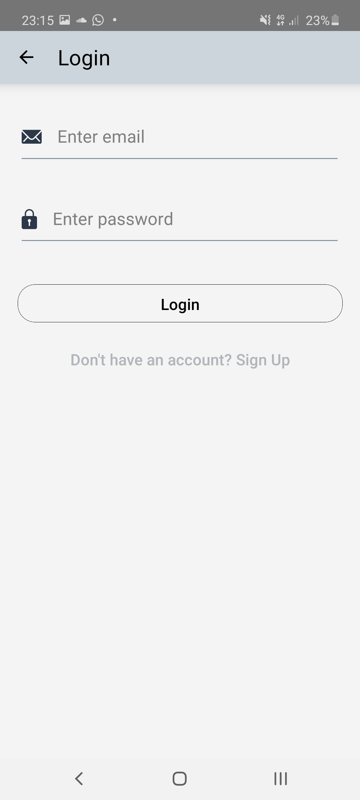

# Sahabat Setia Mobile

  Built with React Native

## Introduction
Sahabat Setia Mobile is library mobile application that can borrow your favorite book, you can search your favotire book in recommendation, category, and all books, you can see detail book, and you can see history of book that being borrowed.

## Features
* Users can see books without login
* Users can borrow book if already logged in
* Users can return book being borrowed
* Users can see history of book that being borrowed or borrowed
* Etc

## Requirements
* [npm](https://www.npmjs.com/get-npm)
* [react-native](https://facebook.github.io/react-native/docs/getting-started)
* [Sahabat-Setia-Api](https://github.com/Vikraardiansyah/sahabat-setia-api)

## Usage for development
1. Open your terminal or command prompt
2. Type `git clone https://github.com/Vikraardiansyah/sahabat-setia-mobile.git`
3. Open the folder and type `npm install` for install dependencies
4. Before run this, you must run backend first
5. Type `react-native run-android` for run this app. **Make sure your device is connected with debugging mode**.

## Screenshots

    
    
    
    
    
    
    
    
    

## Release APK

## Related Project (Backend)
[`Sahabat-Setia-Api`](https://github.com/Vikraardiansyah/sahabat-setia-api)

## Contributors
[Vikra Ardiansyah Zaini](https://github.com/Vikraardiansyah)
